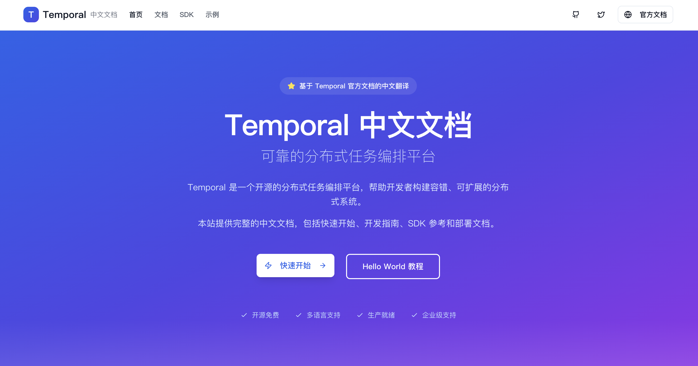
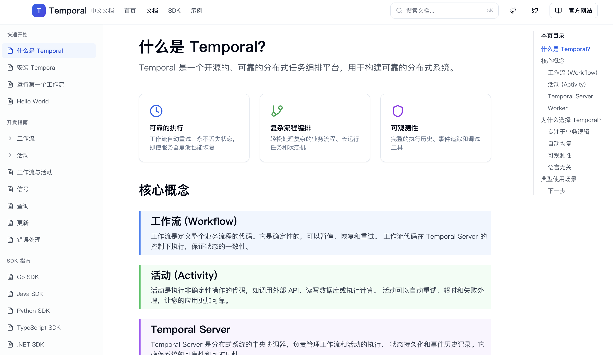

# Temporal 中文文档站

个人维护的 Temporal 中文文档站点，基于 Next.js 16 和 TypeScript 构建。


## 项目简介

本项目是 [Temporal](https://temporal.io) 官方文档的中文翻译版本，旨在为中文开发者提供完整的、准确的 Temporal 技术文档。项目采用现代化的技术栈，提供优秀的阅读体验和便捷的导航功能。

## 网站预览

### 首页



### 文档页面



## 主要特性

- 📚 **完整的文档结构** - 覆盖快速开始、开发指南、SDK 文档、部署指南等核心板块
- 🎨 **现代化 UI 设计** - 基于 shadcn/ui 的优雅界面
- 🔍 **便捷的导航** - 清晰的侧边栏导航和面包屑
- 📱 **响应式设计** - 支持桌面和移动设备
- ⚡ **高性能** - Next.js 16 的优化和静态生成
- 🌍 **中文优化** - 针对中文阅读习惯的专业翻译

## 技术栈

- **框架**: Next.js 16 (App Router)
- **语言**: TypeScript 5
- **UI 组件**: shadcn/ui (基于 Radix UI)
- **样式**: Tailwind CSS 4
- **包管理器**: pnpm

## 快速开始

### 前置要求

- Node.js 18+
- pnpm 9+

### 安装依赖

```bash
pnpm install
```

### 启动开发服务器

```bash
pnpm run dev
```

访问 [http://localhost:5001](http://localhost:5001) 查看站点。

### 构建生产版本

```bash
pnpm run build
```

### 启动生产服务器

```bash
pnpm run start
```

## 部署

本项目支持多种部署方式，详见 [部署指南](./DEPLOYMENT.md)：

- ✅ Vercel（推荐）
- ✅ Docker
- ✅ 传统服务器（PM2 + Nginx）
- ✅ Netlify
- ✅ 静态导出

## 相关链接

- [Temporal 官方文档](https://docs.temporal.io)
- [Temporal GitHub](https://github.com/temporalio/temporal)
- [Next.js 文档](https://nextjs.org/docs)
- [shadcn/ui](https://ui.shadcn.com)

## 许可证

本项目遵循与 Temporal 官方文档相同的许可证。

## 致谢

感谢 [Temporal](https://temporal.io) 团队提供的优秀产品和技术文档。

感谢所有贡献者的辛勤付出！

---

**开始使用 Temporal 构建可靠的分布式应用吧！** 🚀